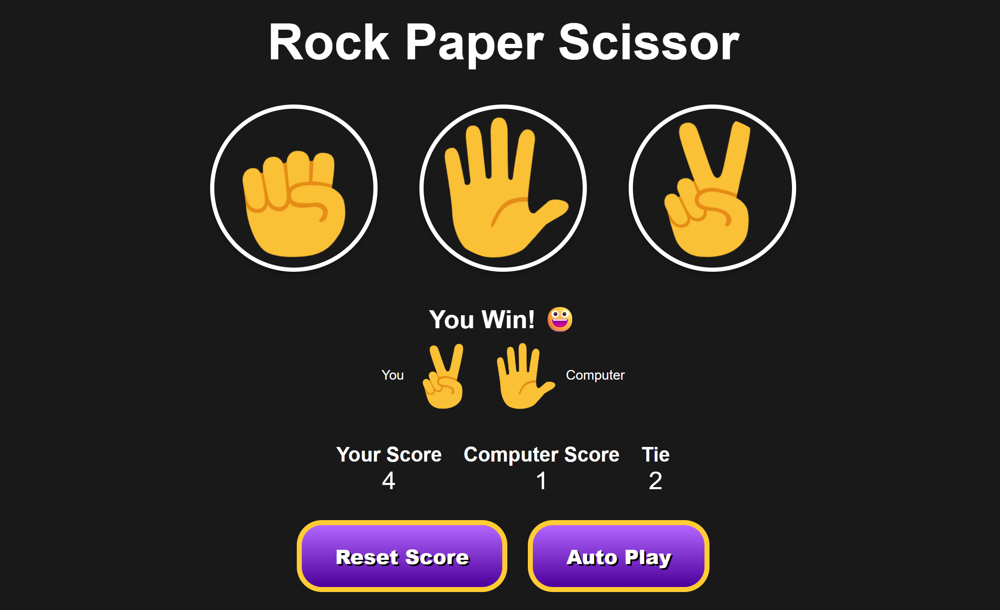

# 🪨📄✂️ Rock Paper Scissors Game

A simple and interactive Rock-Paper-Scissors game built using **HTML**, **CSS**, and **JavaScript**. Play against the computer and track your scores or enable **Auto Play** mode to watch the game run automatically with persistent storage (via `localStorage`). Responsive design included!

---

## 🎮 How to Play

1. Click on **Rock**, **Paper**, or **Scissors** to make your move.
2. The computer randomly selects its move.
3. The result is displayed via an alert popup.
4. Scores are updated and stored in your browser.
5. Click **Reset Score** to clear your progress.

---

## 📸 Screenshots

 

---

## 🎯 Features
- Classic **Rock, Paper, Scissors** gameplay
- Real-time score tracking for:
  - Player score
  - Computer score
  - Tie score
- **Auto Play Mode** (game plays automatically every second)
- Persistent scores using **LocalStorage** (scores remain after page reload)
- Responsive design for mobile devices
- Smooth hover animations and styled buttons

---

## 🛠️ Tech Stack

- **HTML5** – Structure
- **CSS3** – Styling and layout
- **JavaScript (Vanilla)** – Game logic & interactions

---

## 📁 Project Structure
rock-paper-scissors/
│
├── index.html
├── style.css
├── script.js
└── images/
├── stonePlayer.png
├── paperPlayer.png
├── scissorsPlayer.png
└── rock-paper-scissor-game.png

## 📜 License

This project is open-source and free to use for fun or learning.

---

> Made with ❤️ by [VarunCodeZone]